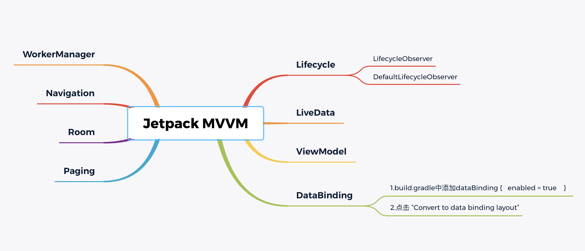
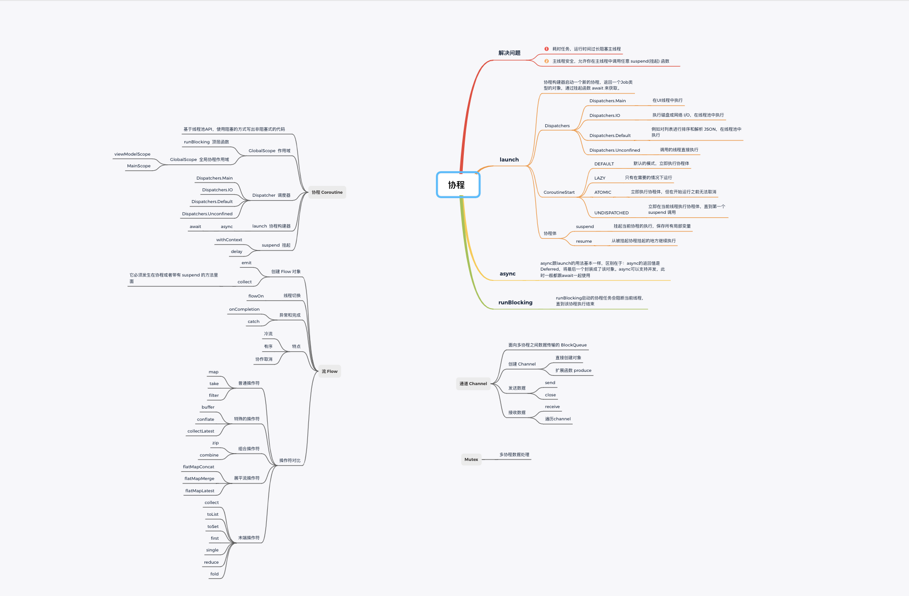
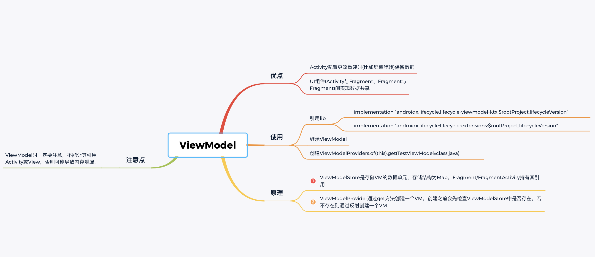
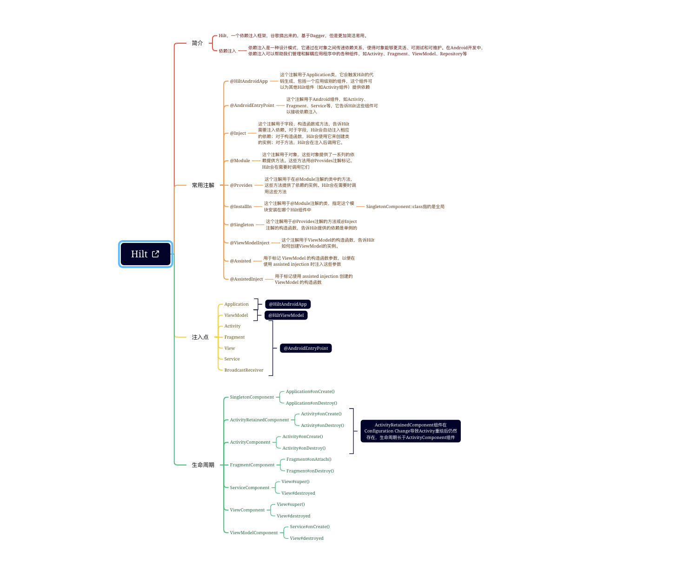
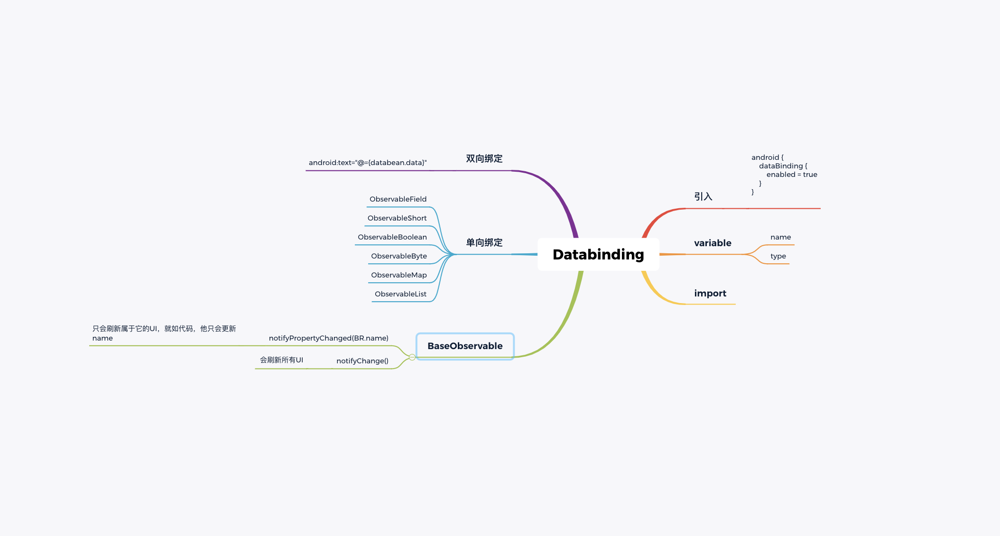
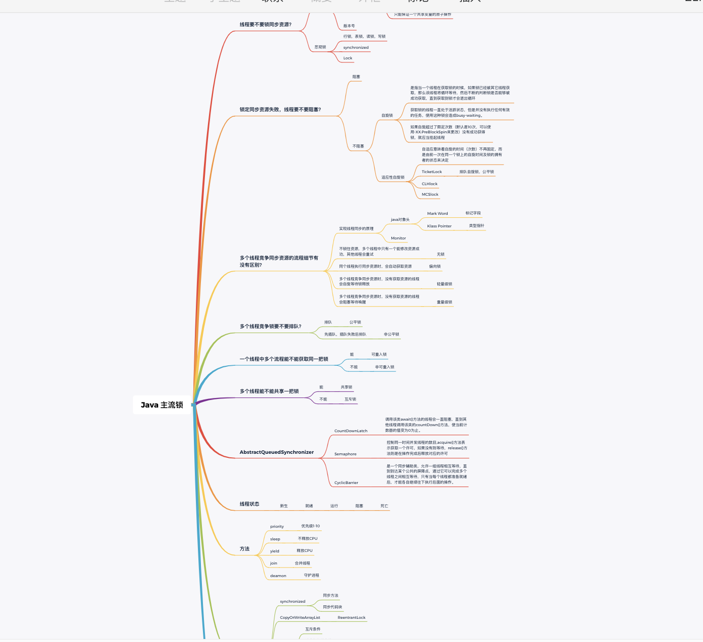
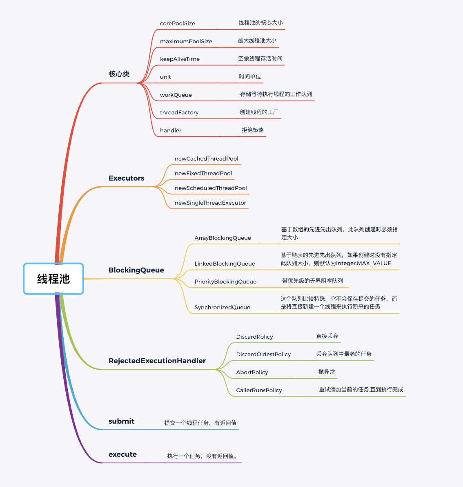
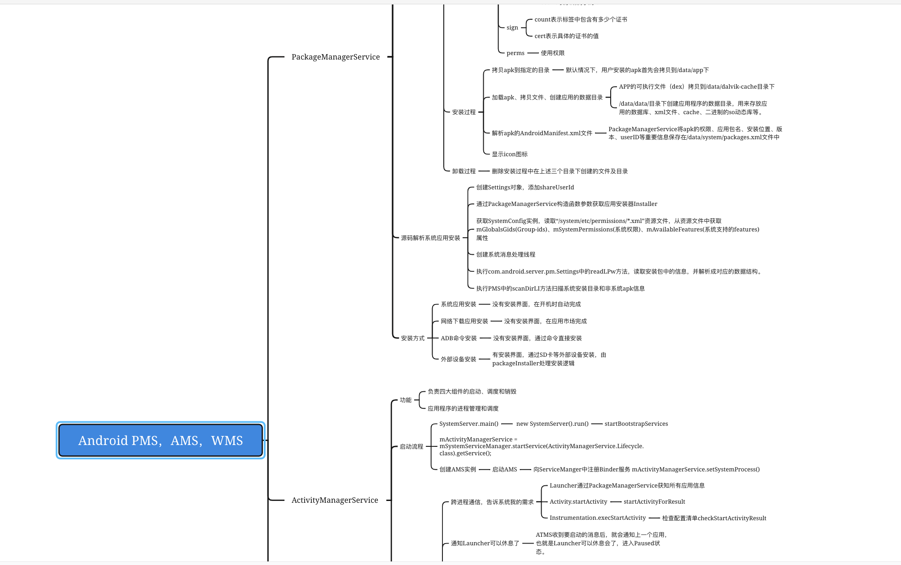
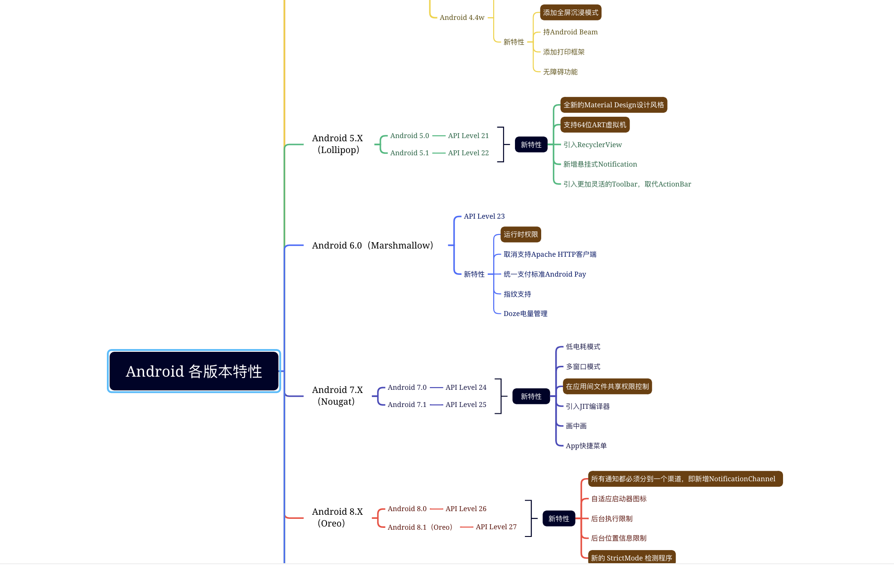
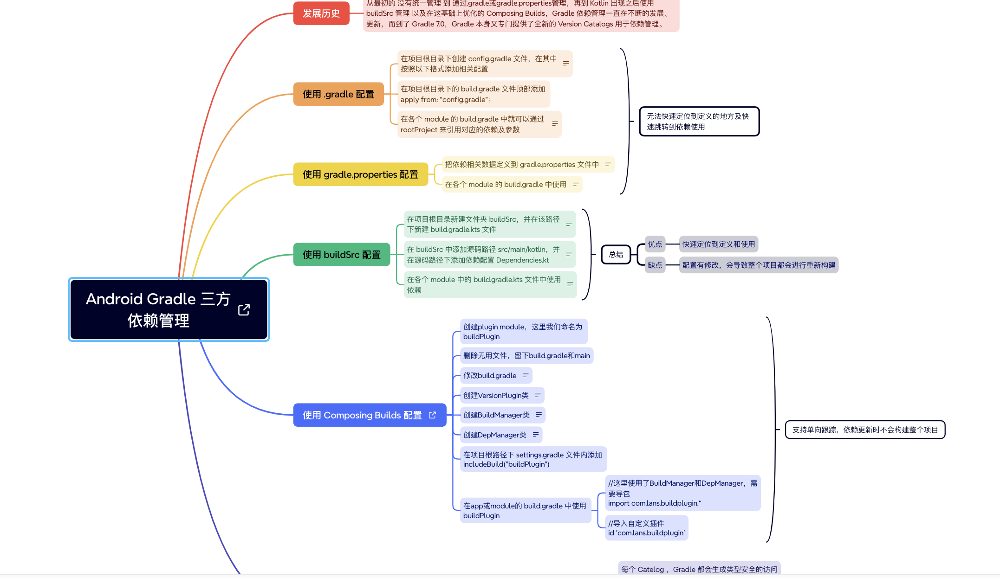

# StudyNotes-Xmind
Android的学习笔记

## Jetpack MVVM

  

## 协程 

  

## ViewModel 

  

## Hilt 

  

## DataBinding 

  

## Java主流锁 

  

## 线程池 

  

## Android Ams Pms Wms 

  

## Android各版本特性 

  

## Android Gradle 第三方依赖管理 

  

